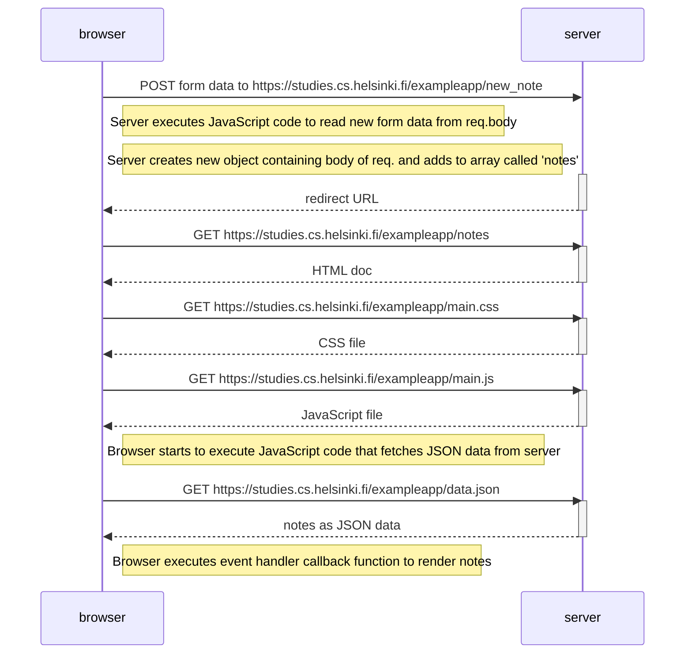

```mermaid
sequenceDiagram

    browser->>server: POST form data to https://studies.cs.helsinki.fi/exampleapp/new_note
    Note right of browser: Server executes JavaScript code to read new form data from req.body
    Note right of browser: Server creates new object containing body of req. and adds to array called 'notes'

    activate server
    server-->>browser: redirect URL
    deactivate server

    browser->>server: GET https://studies.cs.helsinki.fi/exampleapp/notes
    activate server
    server-->>browser: HTML doc
    deactivate server

    browser->>server: GET https://studies.cs.helsinki.fi/exampleapp/main.css
    activate server
    server-->>browser: CSS file
    deactivate server

    browser->>server: GET https://studies.cs.helsinki.fi/exampleapp/main.js
    activate server
    server-->>browser: JavaScript file
    deactivate server

    Note right of browser: Browser starts to execute JavaScript code that fetches JSON data from server
    

    browser->>server: GET https://studies.cs.helsinki.fi/exampleapp/data.json
    activate server
    server-->>browser: notes as JSON data
    deactivate server

    Note right of browser: Browser executes event handler callback function to render notes

```

