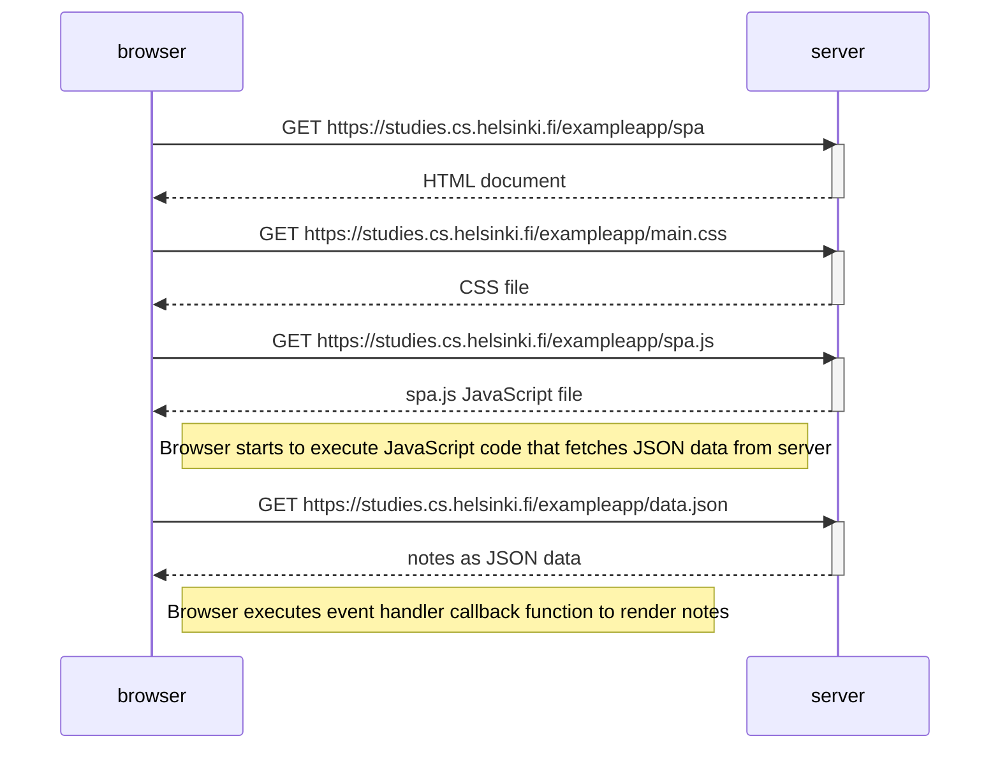

```mermaid

sequenceDiagram

  browser->>server: GET https://studies.cs.helsinki.fi/exampleapp/spa
  activate server
  server-->>browser: HTML document
  deactivate server

  browser->>server: GET https://studies.cs.helsinki.fi/exampleapp/main.css
  activate server
  server-->>browser: CSS file
  deactivate server

  browser->>server: GET https://studies.cs.helsinki.fi/exampleapp/spa.js
  activate server
  server-->>browser: spa.js JavaScript file
  deactivate server

  Note right of browser: Browser starts to execute JavaScript code that fetches JSON data from server

  browser->>server: GET https://studies.cs.helsinki.fi/exampleapp/data.json
  activate server
  server-->>browser: notes as JSON data
  deactivate server

  Note right of browser: Browser executes event handler callback function to render notes

```